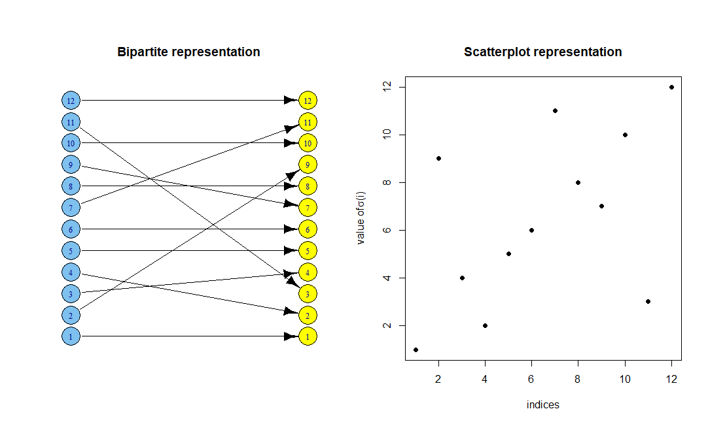
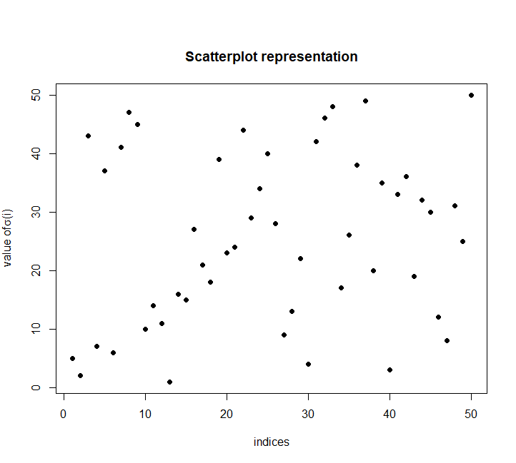
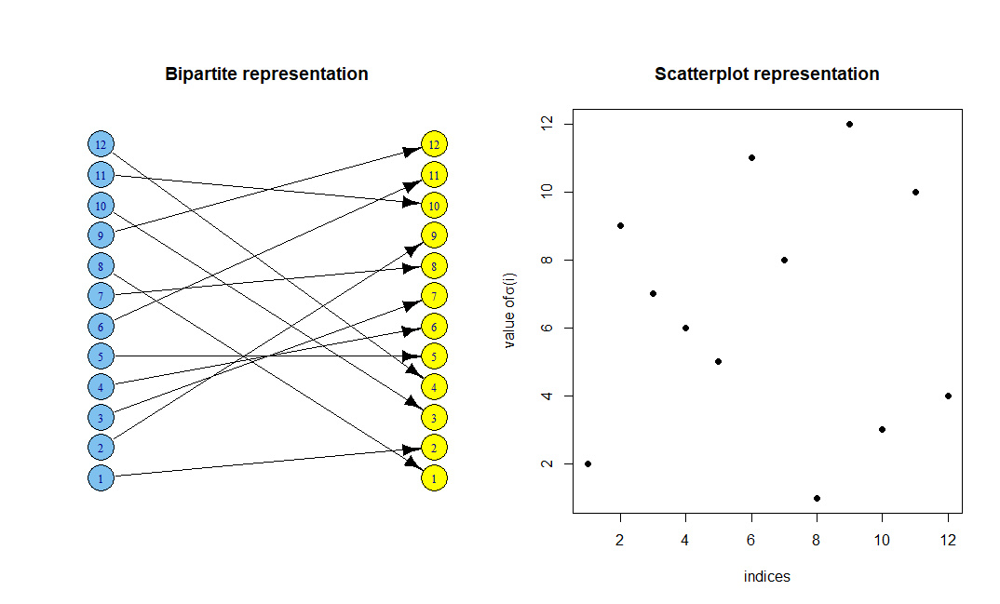
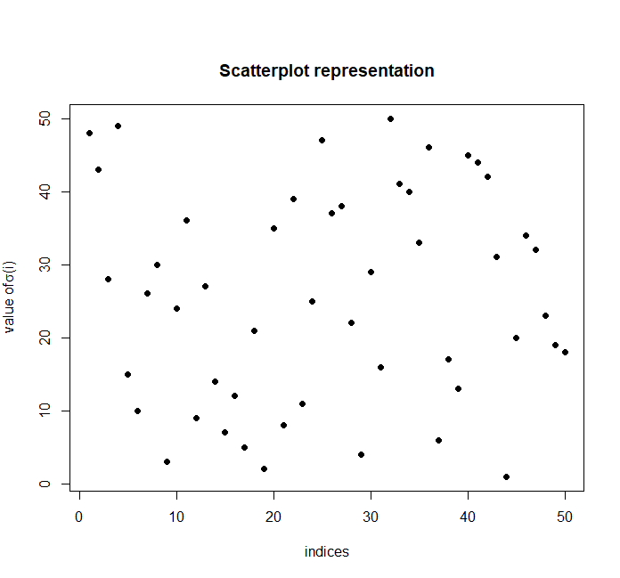

## What is a permutation?
A permutation is an ordered arrangement of the elements in a set. For instance, consider the set of the numbers 1 through 3. There are six possible permutations of this set: (1, 2, 3), (1, 3, 2), (2, 1, 3), (2, 3, 1), (3, 1, 2), and (3, 2, 1). On the set of numbers 1 through n, there are n! permutations.

## Generating a random permutation
Let's say we wanted to write a program that would simulate shuffling a standard deck of 52 cards. Well, this seems simple enough: number each card, and then generate a random permutation of the set of numbers from 1 to 52. The position of each number in our permutation then becomes the position of the corresponding card in our shuffled deck. 

But how do we actually generate the permutation? 52 isn't a very large number, but the number of possible permutations - 52! - is huge. Using a "brute force" method of listing all possible permutations and then picking one at random is very computationally expensive. Here's one approach that's easier for the computer to handle:

1) Begin with all the numbers {1, 2, . . ., 52} listed in ascending order. 
2) Pick two indices (between 1 and 52 inclusive) uniformly at random. 
3) If the same index is picked twice, do nothing. 
4) If two different indices are picked, swap the numbers at those indices. 
5) Repeat steps 2-4 for some number of iterations. 

The obvious question here is, how many times do we need to repeat the process? If we just do one or two swaps, we'll end up with a permutation very close to our starting state - the order of the cards will barely change at all. It turns out that for a set of n elements, it takes close to 0.5nlog(n) steps for this process to converge to a random permutation with the accuracy increasing with increasing n. The exact bound is 0.5nlog(n) + Cn, where C is a constant depending on how much mixing is required. 0.5nlog(n) + Cn = (0.5log(n) + C)n, which makes 0.6nlog(n) a good upper bound. So for our deck of cards, we'll want to run the program for around 0.6 * 52log(52) = 123 steps. 

## Is it really random?
Our null hypothesis here is that the generated permutation is uniformly distributed.

Each of the 4 tests below will produce a corresponding p-value. Setting a cut-off for the p-value is tricky and controversial, so we can only make subjective decisions regarding when to reject the null hypothesis. However, we might not want to see p-values less than 0.05.

[Wikipedia](https://en.wikipedia.org/wiki/P-value) has lots of background information about the p-value.

###   Spearman's Footrule
Consider the identity permutation π = (1, 2, 3, 4, 5, 6) and the permutation σ = (4, 1, 2, 5, 3, 6). The first test statistic we will compute is the sum of the absolute value of the difference between π(i) and σ(i), which is called the Spearman's footrule. 

 Let D(π, σ) = Σ|π(i) - σ(i)|, where 1 ≤ i ≤ n. 

Footrule has these properties:

Mean = 

Variance = 

 has a standard normal limiting distribution.

We are therefore able to calculate a p-value for our test statistic. In our example, D = 3 + 1 + 1 + 1 + 2 + 0 = 8, mean = 35/3 = 11.667, variance = (6+1)(72+7)/45 = 12.289, and SD =  = 3.506. Our standardized variable is therefore -1.046. Using a standard normal distribution Z table, we can calculate that the two-tailed p-value is about 0.29558.

###   Spearman's rank correlation
Again, π = (1, 2, 3, 4, 5, 6) and σ = (4, 1, 2, 5, 3, 6). The second test statistic we will compute is the sum of the square of the difference between π(i) and σ(i), which is called the Spearman's rank correlation. 

Let  =Σ, where 1 ≤ i ≤ n. 

Spearman's rank correlation has these properties:

Mean = 

Variance = 

 has a standard normal limiting distribution.

We are therefore able to calculate a p-value for our test statistic. In our example,  = 9 + 1 + 1 + 1 + 4 + 0 = 16, mean = 210/6 = 35, variance = 36(5)(49)/36 = 245, and SD =  = 15.652. Our standardized variable is therefore -1.214. Using a standard normal distribution Z table, we can calculate that the two-tailed p value is about 0.22479.

###   Hamming distance
Again, π = (1, 2, 3, 4, 5, 6) and σ = (4, 1, 2, 5, 3, 6). The third test statistic we will compute is the number of positions whose numbers are diffrent from those in the identity premutation, which is call the Hamming distance. 

Let H(π, σ) = #{i: π(i) ≠ σ(i)}, where 1 ≤ i ≤ n. 

n - H, the total number of fixed points in σ where π(i) = σ(i), has a limiting Poisson(1) distribution. 

In our example, H = 5, n - H = 6 - 5 = 1, λ = 1. We are therefore able to calculate a p-value for our test statistic. The upper-tailed p-value is P(n - H ≥ 1) = 1 - P(n - H < 1) = 1 - P(n - H = 0) = 1 -  = 1 - 0.3678794 = 0.6321206.

###   Kendall's tau
Again, π = (1, 2, 3, 4, 5, 6) and σ = (4, 1, 2, 5, 3, 6). The final test statistic we will compute is the number of inversions in σ compared to π, or the number of pairs (i, j) where i < j and the number in the ith position is greater than the number in the jth position in σ. 

What does this look like concretely? Note that in a set of n elements, there are  pairs of elements, so in our example, where n = 6, there are  = 15 pairs. How many of these are inversions? 

Let's look at the pair (1, 2). The first entry in σ is 4 and the second entry is 1. 4 > 1, so this is an inversion.

Now let's consider (1, 3). The first entry is 4 and the third entry is 2. 4 > 2, so this is also an inversion.

How about (1, 4)? The first entry is 4 and the fourth entry is 5. 4 < 5, so this is not an inversion.

Continue this process for all 15 pairs and we will find that there are 4 inversions: (1, 2), (1, 3), (1, 5), and (4, 5). 

The number of inversions is also equal to the minimum number of pairwise adjacent transpositions required to bring  to . This statistic is known as I(π, σ), or Kendall's tau.

Kendall's tau has these properties:

Mean = 

Variance = 

 has a standard normal limiting distribution.

We are therefore able to calculate a p-value for our test statistic. In our example, I = 4, mean = 15/2 = 7.5, variance = 6(6-1)(12+5)/72 = 7.083, and SD =  = 2.66. Our standardized variable is therefore -1.32. Using a standard normal distribution Z table, we can calculate that the two-tailed p-value is about 0.187.

## Visualizing permutations
Below are a few visualizations of permutations generated using the process described in our card-shuffling example.

###   Running for 0.3nlog(n) steps
First, let's look at a couple of permutations generated when the process is run for 0.3nlog(n) steps. This is not enough steps for the process to converge to a uniform distribution over all permutations, so we should expect the p values from our statistical tests to be pretty small here.

Here is an example of a permutation with n = 12. The visualizations shown are: 
* A bipartite graph mapping the indices of the permutation (on the left) to the element at each index in the permutation (on the right).
* A scatterplot mapping the indices to the element at each index.

Here is a table of the p values from our statistical tests:

| Test                        | p value      |
| --------------------------- | ------------ |
| Footrule                    | 0.0103574528 |
| Spearman's rank correlation | 0.0861079997 |
| Hamming distance            | 0.0005941848 |
| Kendall's tau               | 0.0548539399 |

Here is an example of a permutation with n = 50. (The bipartite graph gets visually chaotic with larger values of n, so only the scatterplot is shown here.)

Note the p values from our statistical tests: 

| Test                        | p value      |
| --------------------------- | ------------ |
| Footrule                    | 0.0510076617 |
| Spearman's rank correlation | 0.1775827162 |
| Hamming distance            | 0.0005941848 |
| Kendall's tau               | 0.1300158834 |

###   Running for 0.7nlog(n) steps
Now let's look at a couple of examples when the process has been run for 0.7nlog(n) steps. 

Here is an example where n = 12:

Note how much larger the p values are: 

| Test                        | p value   |
| --------------------------- | --------- |
| Footrule                    | 0.9711963 |
| Spearman's rank correlation | 0.7630246 |
| Hamming distance            | 0.6321206 |
| Kendall's tau               | 0.7838616 |

And here is an example where n = 50:

Again, note the larger p values:

| Test                        | p value   |
| --------------------------- | --------- |
| Footrule                    | 0.7399849 |
| Spearman's rank correlation | 0.7188471 |
| Hamming distance            | 1         |
| Kendall's tau               | 0.7825171 |

We can see from our visualizations and p values that the random transposition process did not appear to mix when we ran it for 0.3nlog(n) steps, but it did when we ran it for 0.7nlog(n) steps.

## Additional resources
[Read more](https://en.wikipedia.org/wiki/Permutation) about permutations on Wikipedia.  
See [this article](https://www.pnas.org/content/pnas/93/4/1659.full.pdf) in PNAS for an explanation of the mixing time of the random transposition process.
See [Chapter 6](https://projecteuclid.org/euclid.lnms/1215467415) of _Group Representations in Probability and Statistics_ by Persi Diaconis for explanations of Spearman's footrule, Spearman's rank correlation, Hamming distance, and Kendall's tau.  
[View](https://github.com/jamie-forschmiedt/permutations/blob/gh-pages/random-permutation.R) the R code to generate the permutations, run the statistical tests, and produce the bipartite and scatterplot graphs.
